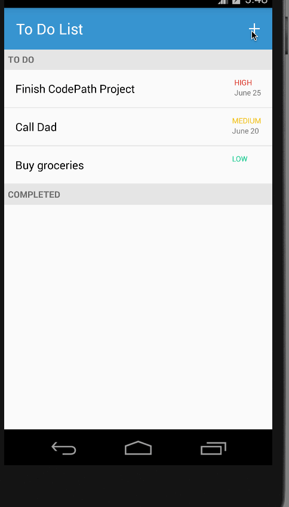

# Pre-work - *To Do List*

**To Do List** is an android app that allows building a todo list and basic todo items management functionality including adding new items, editing and deleting an existing item.

Submitted by: **Iris Wang**

Time spent: **12-15** hours spent in total

**Note**: I initially started the app a few months ago, but the bootcamp was moved so I lost track of how much time I initially put into it.

## User Stories

The following **required** functionality is completed:

* [x] User can **successfully add and remove items** from the todo list
* [x] User can **tap a todo item in the list and bring up an edit screen for the todo item** and then have any changes to the text reflected in the todo list.
* [x] User can **persist todo items** and retrieve them properly on app restart

The following **optional** features are implemented:

* [x] Persist the todo items [into SQLite](http://guides.codepath.com/android/Persisting-Data-to-the-Device#sqlite) instead of a text file
* [x] Improve style of the todo items in the list [using a custom adapter](http://guides.codepath.com/android/Using-an-ArrayAdapter-with-ListView)
* [x] Add support for completion due dates for todo items (and display within listview item)
* [x] Use a [DialogFragment](http://guides.codepath.com/android/Using-DialogFragment) instead of new Activity for editing items
(**Disclaimer**: I originally did this, but found that I wanted to add a new activity instead)
* [x] Add support for selecting the priority of each todo item (and display in listview item)
* [x] Tweak the style improving the UI / UX, play with colors, images or backgrounds

The following **additional** features are implemented:

* [x] Sorts tasks based on priority
* [x] Added priority to tasks
* [x] Added due date to tasks
* [x] Added notes to tasks
* [x] Improved code structure of app
* [x] Splits tasks into two sections: To-Do, Completed
* [x] Added a navigation drawer (separates out tasks that are due today vs all tasks)
* [x] Added alerts for canceling without saving tasks

## Video Walkthrough 

Here's a walkthrough of implemented user stories:

GIF created with [LiceCap](http://www.cockos.com/licecap/).

## Notes

**Challenges**

Some of the guides had some outdated code. I forgot which ones, but I can probably go through and find/fix them. Overall, the guides
were really good for the initial set up. I've read through additional codepath guides for more features and those were really helpful too. Thank you for putting all this work into this!

## License

    Copyright [2016] [Iris Wang]

    Licensed under the Apache License, Version 2.0 (the "License");
    you may not use this file except in compliance with the License.
    You may obtain a copy of the License at

        http://www.apache.org/licenses/LICENSE-2.0

    Unless required by applicable law or agreed to in writing, software
    distributed under the License is distributed on an "AS IS" BASIS,
    WITHOUT WARRANTIES OR CONDITIONS OF ANY KIND, either express or implied.
    See the License for the specific language governing permissions and
    limitations under the License.

